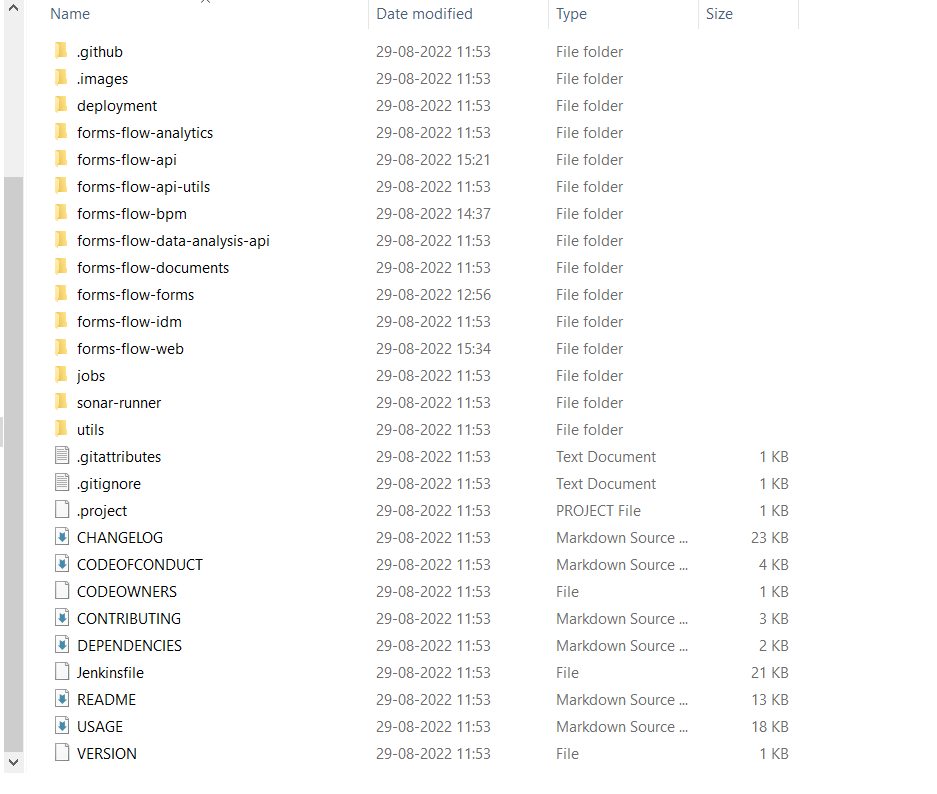

# Download and Installation
{: .no_toc }

## Table of contents
{: .no_toc .text-delta }

1. TOC
{:toc}
----

## Download formsflow.ai
 To download and set up, follow the installation guide, where you will find step-by-step instructions to download and install.  
 Clone this github repo: [https://github.com/AOT-Technologies/forms-flow-ai](https://github.com/AOT-Technologies/forms-flow-ai).

Folder structure will look like below:

---

  *Copyright© [formsflow.ai](https://formsflow.ai/)*   
  {: .text-center .mt-8}