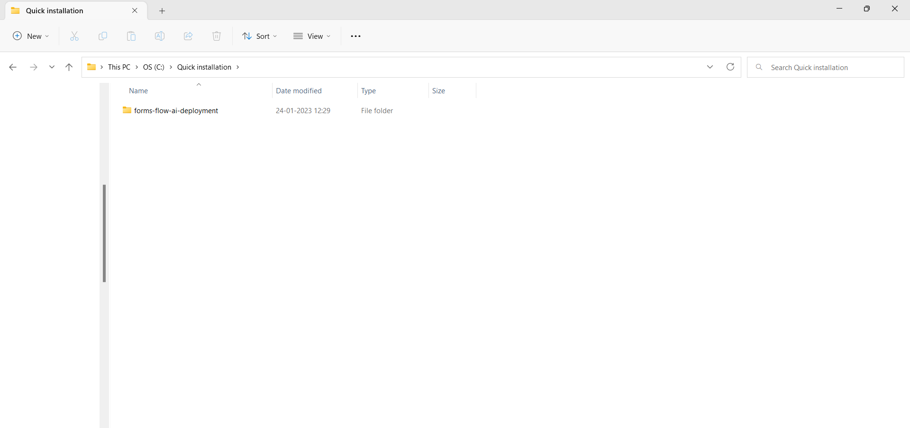
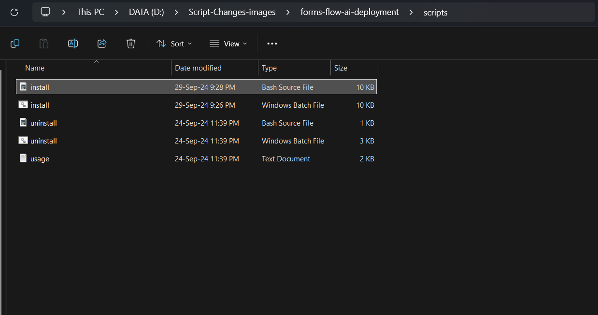
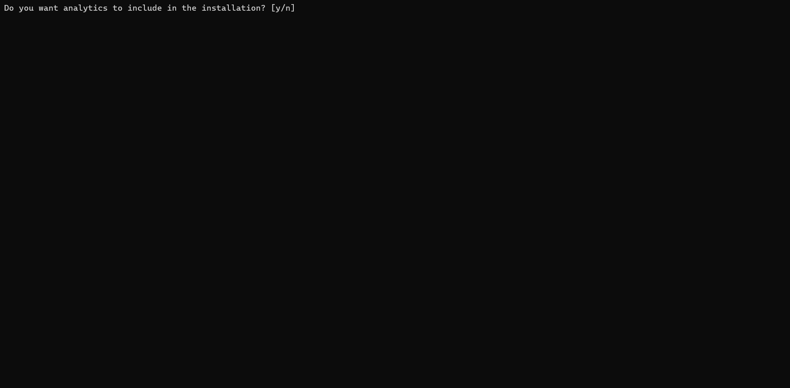
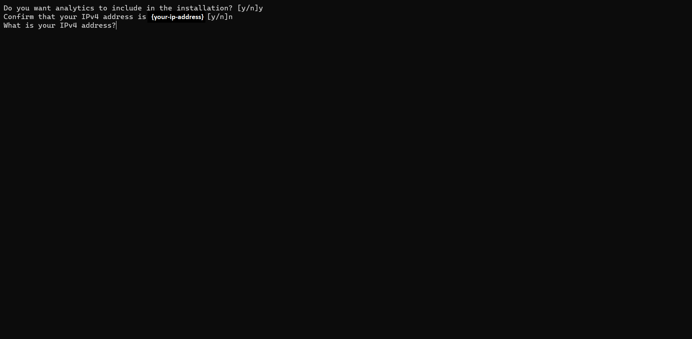
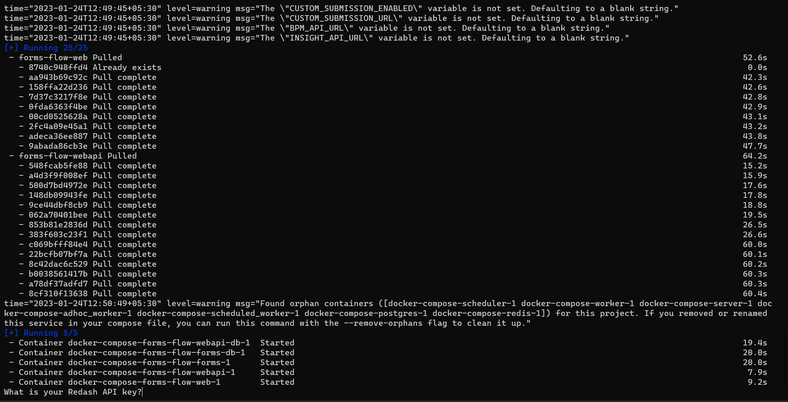
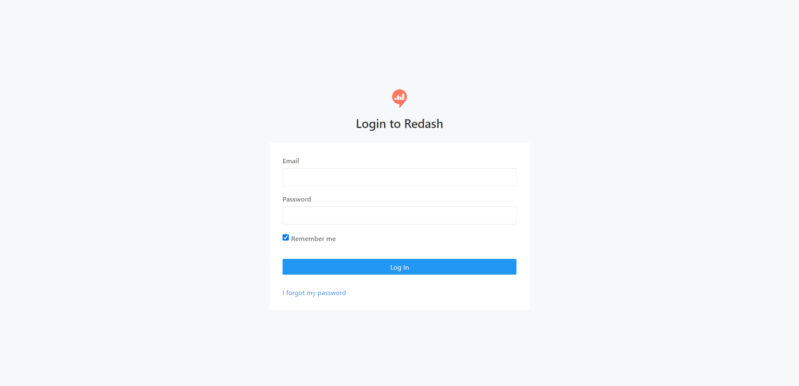
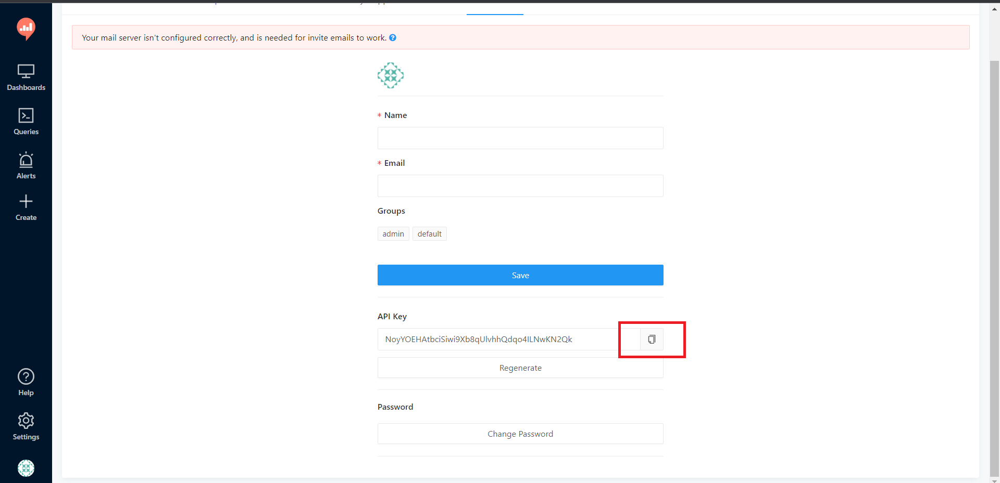

## Linux Installation  

---

Quick Installation is the most basic and simplest type of formsflow Installation. Running a single script file installs formsflow and all its dependencies.Formsflow installed through Quick installation method is used to test the basic features of formsflow.  

### System requirements  

- 64-bit kernel and CPU support for virtualization.
- minimum 4 GB RAM , 20 GB Storage.

## Quick Installation 

---

The quick-installation option saves time and labour, and is less error prone than manual installation. It helps you set up a running environment of formsflow.ai by installing the necessary packages and customizing the configuration files automatically. 

### Prerequisites

- For installation of formsflow.ai, the [Docker Desktop](https://www.docker.com/) needs to be installed . If Docker has been installed, and if any previous formsflow.ai installations were done already, those need to be removed from the Docker Desktop.  

>  _click <a target="_blank" href="/forms-flow-installation-doc/Pages/supporting_version.html">here</a> to see tested OS configurations_  
{: .bg-grey-lt-000 .p-2}

## Steps for formsflow.ai Installation  

1. Download the following installation bundle to perform Quick Installation.

     
     [Formsflow.ai-zip](https://github.com/AOT-Technologies/forms-flow-ai-deployment/archive/refs/heads/main.zip){: .btn .btn-purple .mr-4}
        

2. Extract the contents of the downloaded zip file in the desired location.   

3. Open terminal ,Navigate to directory `/script `, Run the command `bash install.bash`.

    OR 

   Open the Extracted folder, choose the folder forms-flow-ai-deployment and then open the folder scripts.
   - Double click the bash script 
   - Open the terminal and make sure your current working directory is `forms-flow-ai-deployment\scripts`
   - Run the command `bash install.bash`

   <!--  -->

   
   {: .mt-6 .ml-6}

4. The installation starts with the following question,
    
   
   {: .mt-6 .ml-6}  
   
   *a*.  If you need Redash Analytics Engine in the installation, provide ‘y’ as the answer, or else answer ‘n’. (To know more about Redash  Analytics Engine, please visit [Redash](https://redash.io/help/) ).  
   {: .ml-5}
  
   
   {: .mt-6 .ml-6}  
    *b*. Verify the IP address is valid or incorrect after that. If true, provide  'y' as the answer, or else answer ‘n’.    
      {: .ml-5}
     
    {: .mt-6 .ml-6}    
   *c*. Provide the proper ip address.
   {: .ml-5}

5. As part of the installation, if the user has chosen the option to install with “Analytics” the user is asked to enter the Redash API key after the successful installation of Redash.  

   
   {: .mt-6 .ml-6} 

6. The Redash application should be available for use at port defaulted to 7000. Open [http://localhost:7000/](http://localhost:7000/) on your machine and register with any valid credentials.

   
   {: .mt-6 .ml-6} 

7. To get the Redash API key, log in to [http://localhost:7000/](http://localhost:7000/),Choose Settings>>Account, and copy the API Key.

   
   {: .mt-6 .ml-6} 

8. Copy the API Key and paste it into the cmd. The installation will continue.  

9. Once the installation is complete, the command prompt displays the installation is complete. The Docker Desktop displays all the installed containers.  

### Health Check 
 - Analytics should be up and available for use at port defaulted to 7001 i.e.<a target="_blank" href="http://localhost:7001/">http://localhost:7001/</a>.
 - Business Process Engine should be up and available for use at port defaulted to 8000 i.e. <a target="_blank" href="http://localhost:8000/camunda/">http://localhost:8000/camunda/</a>.
 - FormIO should be up and available for use at port defaulted to 3001 i.e. <a target="_blank" href="http://localhost:3001/checkpoint">http://localhost:3001/checkpoint</a> .
 - formsflow.ai REST API should be up and available for use at port defaulted to 5000 i.e. <a target="_blank" href="http://localhost:5000/checkpoint">http://localhost:5000/checkpoint</a> .
 - formsflow.ai web application should be up and available for use at port defaulted to 3000 i.e. <a target="_blank" href="http://localhost:3000/">http://localhost:3000/</a>.
 - Default user credentials are provided <a target="_blank" href="/forms-flow-installation-doc/Pages/user_credentials.html">here</a> .

 ---

If you face any issues while installing ,please connect with [us](https://github.com/AOT-Technologies/forms-flow-ai/issues).
{: .text-center }
 
*Copyright© [formsflow.ai](https://formsflow.ai/)*   
{: .text-center}

