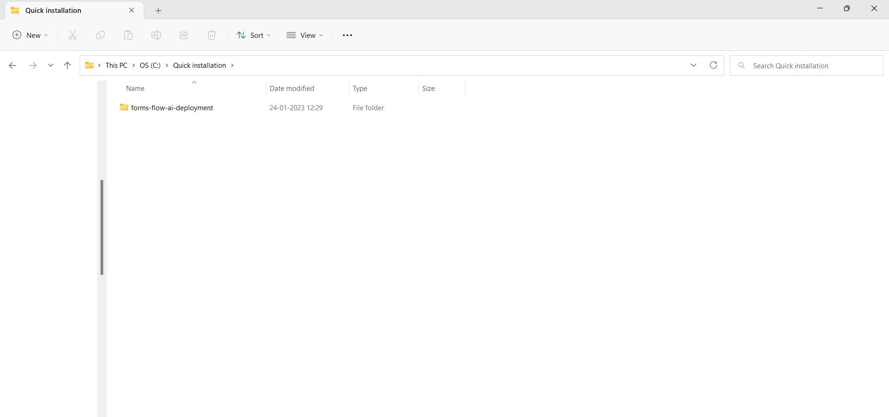
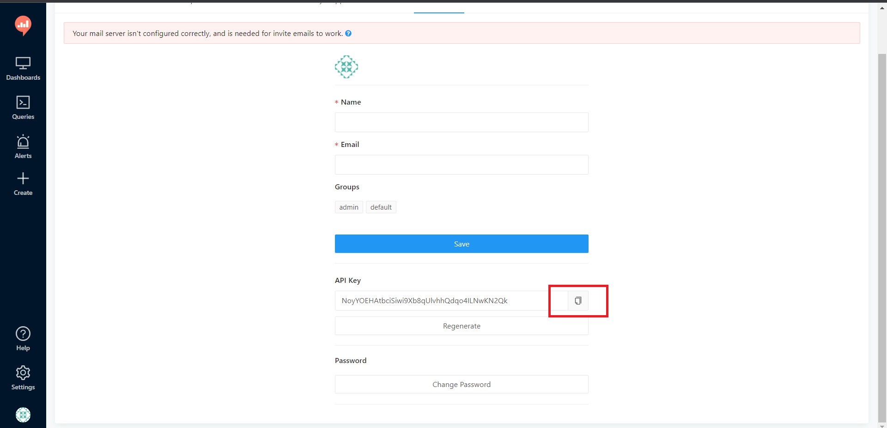
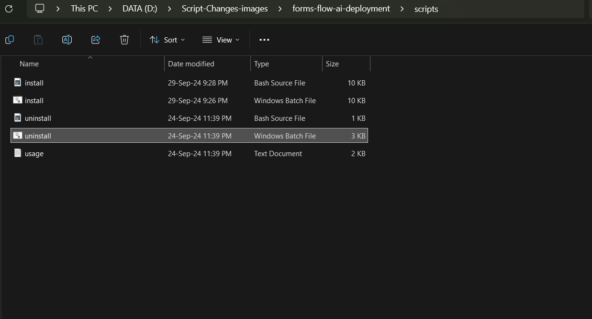

## Windows Installation


---


Quick Installation is the most basic and simplest type of formsflow Installation. Running a single script file installs formsflow and all its dependencies.Formsflow installed through Quick installation method is used to test the basic features of formsflow.  


### System requirements
 
- 64-bit with at least 16GB RAM and 25GB HDD  

## Quick Installation 

---

The quick-installation option saves time and labour, and is less error prone than manual installation. It helps you set up a running environment of formsflow.ai by installing the necessary packages and customizing the configuration files automatically. 


### Prerequisites

- For installation of formsflow.ai, the [Docker Desktop](https://www.docker.com/) needs to be installed . If Docker has been installed, and if any previous formsflow.ai installations were done already, those need to be removed from the Docker Desktop.  

>  _click <a target="_blank" href="/forms-flow-installation-doc/Pages/supporting_version.html">here</a> to see tested OS configurations_  
{: .bg-grey-lt-000 .p-2}


## Steps for formsflow.ai Installation  

1.Download the following installation bundle to perform Quick Installation.
  
<span class="fs-5">
[Formsflow.ai-zip](https://github.com/AOT-Technologies/forms-flow-ai-deployment/archive/refs/heads/main.zip){: .btn .btn-purple .mr-4}
</span>   

2.Extract the contents of the downloaded zip file in the desired location.   

3.Open the Extracted folder, choose the folder forms-flow-ai-deployment and then open the folder scripts.

  
  
4.Double click on the install.bat file for quick Installation. 

 
  {: .mt-6 .ml-6}

5.The installation starts with the following question,

 
  {: .mt-6 .ml-6}  

  *a*.  If you need Redash Analytics Engine in the installation, provide ‘y’ as the answer, or else answer ‘n’. (To know more about Redash Analytics Engine, please visit [Redash](https://redash.io/help/) ).  
 {: .ml-5}

 
 {: .mt-6 .ml-6}  
  *b*. Verify the IP address is valid or incorrect after that. If true, provide  'y' as the answer, or else answer ‘n’.    
  {: .ml-5}
   
  {: .mt-6 .ml-6}    
 *c*. Provide the proper ip address.
 {: .ml-5}

6.As part of the installation, if the user has chosen the option to install with “Analytics” the user is asked to enter the Redash API key after the successful installation of Redash.  

 
  {: .mt-6 .ml-6} 

7.The Redash application should be available for use at port defaulted to 7000. Open [http://localhost:7000/](http://localhost:7000/) on your machine and register with any valid credentials.

 
  {: .mt-6 .ml-6} 

8.To get the Redash API key, log in to [http://localhost:7000/](http://localhost:7000/),Choose Settings>>Account, and copy the API Key.

 
  {: .mt-6 .ml-6} 

9.Copy the API Key and paste it into the cmd. The installation will continue.  

10.Once the installation is complete, the command prompt displays the installation is complete. The Docker Desktop displays all the installed containers. 
## Mail-Configuration-quick-installation
For the email-configuration for “Quick-installation”, follow the steps below:- 

- Create a directory inside the configuration folder(Inside docker-compose directory) named bpm-mail-config. 
- Create a file name mail.config.properties inside the bpm-mail-config
directory and copy the below contents and update the values as needed. 

```
# Send mails via SMTP. The given settings are for Gmail 
mail.transport.protocol=smtp

mail.smtp.host=smtp.gmail.com
mail.smtp.port=465
mail.smtp.auth=true
mail.smtp.ssl.enable=true
mail.smtp.socketFactory.port=465
mail.smtp.socketFactory.class=javax.net.ssl.SSLSocketFactory

# Poll mails via IMAPS.
mail.store.protocol=imaps
mail.imaps.host=imap.gmail.com
mail.imaps.port=993
mail.imaps.timeout=10000

mail.sender=donotreply
mail.sender.alias=DoNotReply

mail.attachment.download=true
mail.attachment.path=attachments

# Credentials
mail.user=CHANGEME@gmail.com
mail.password=CHANGEME
```
{: .ml-6}

{: .mt-6 .ml-6} 

- Now run the container to verify the changes. 


## Mail-configuration-Main Repository 

- Clone the Github repository  <a target="_blank" href="https://github.com/AOT-Technologies/forms-flow-ai.git">https://github.com/AOT-
Technologies/forms-flow-ai.git</a>.
- Edit the changes needed inside `forms-flow-bpm/forms-flow-bpm-
camunda/src/main/resources/mail-config.properties`.
- Then run the container to see the reflected changes.

### Health Check 
 - Analytics should be up and available for use at port defaulted to 7001 i.e.<a target="_blank" href="http://localhost:7001/">http://localhost:7001/</a>.
 - Business Process Engine should be up and available for use at port defaulted to 8000 i.e. <a target="_blank" href="http://localhost:8000/camunda/">http://localhost:8000/camunda/</a>.
 - FormIO should be up and available for use at port defaulted to 3001 i.e. <a target="_blank" href="http://localhost:3001/checkpoint">http://localhost:3001/checkpoint</a> .
 - formsflow.ai REST API should be up and available for use at port defaulted to 5000 i.e. <a target="_blank" href="http://localhost:5000/checkpoint">http://localhost:5000/checkpoint</a> .
 - formsflow.ai web application should be up and available for use at port defaulted to 3000 i.e. <a target="_blank" href="http://localhost:3000/">http://localhost:3000/</a>.
 - Default user credentials are provided <a target="_blank" href="/forms-flow-installation-doc/Pages/user_credentials.html">here</a> .


### Uninstall Formsflow  
To uninstall formsflow installed through quick installation, click  the uninstall file in the `\forms-flow-ai-deployment\scripts` directory  

 
{: .mt-6 .ml-6} 
---

If you face any issues while installing ,please connect with [us](https://github.com/AOT-Technologies/forms-flow-ai/issues).
{: .text-center }
<br>
*Copyright© [formsflow.ai](https://formsflow.ai/)*   
{: .text-center}