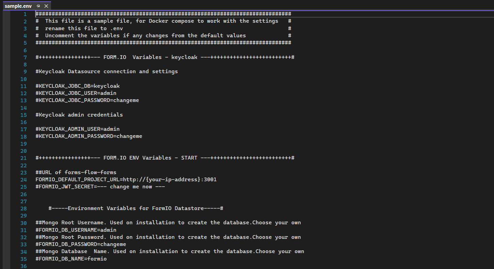
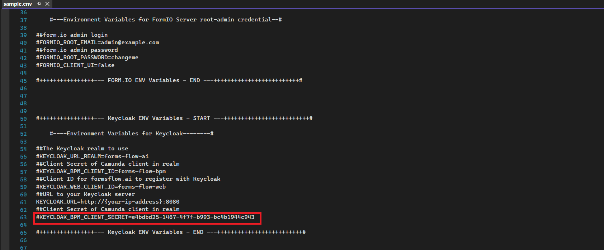
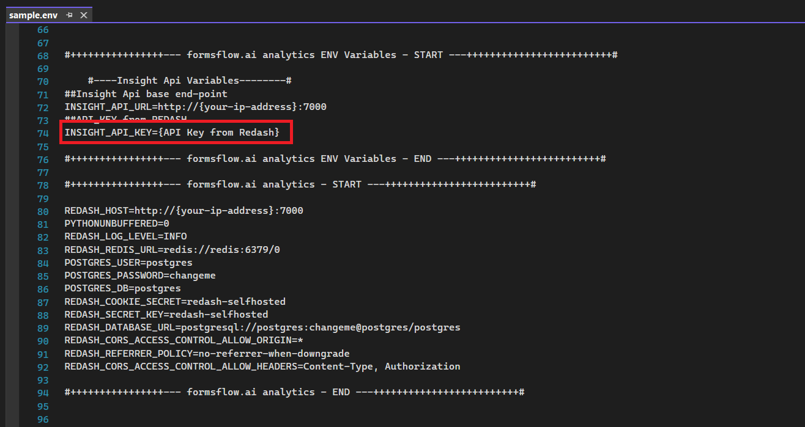
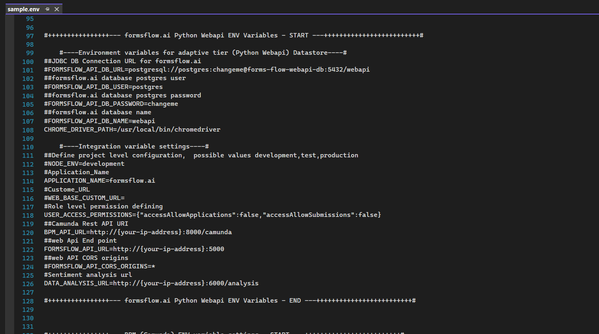
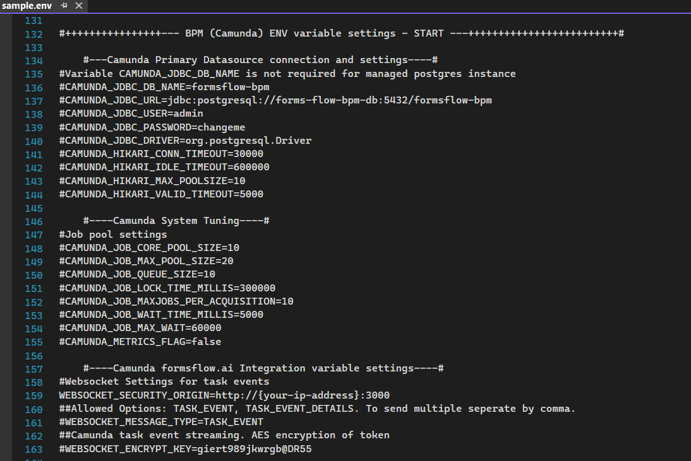
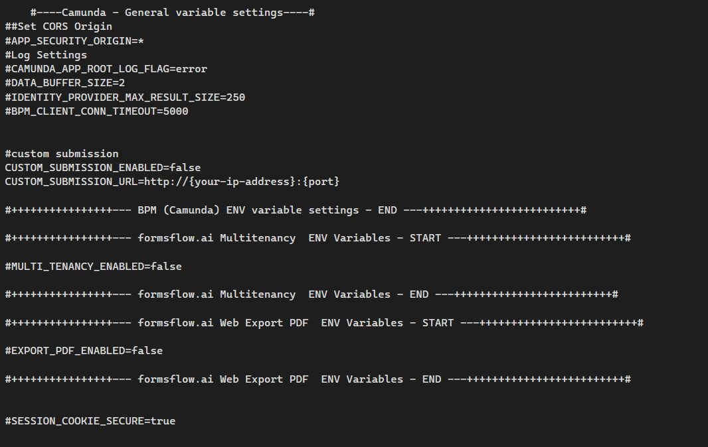
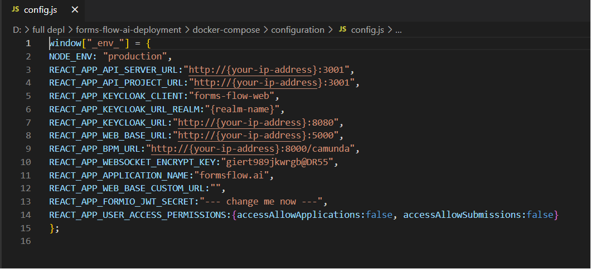
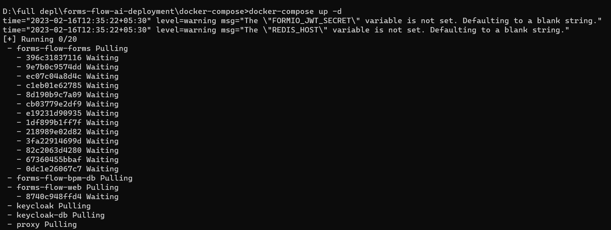
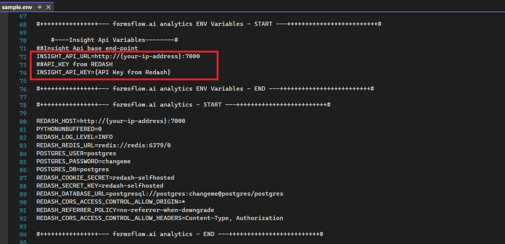

## Docker Full Deployment

---

This type of deployment allows users to customize formsflow by modifying the environment variables. Keycloak, Forms, and other dependencies are installed as a single bundle. If Analytics is required, it must be installed separately.  

### Prerequisites  
- Admin access to a local or remote server ( 64-bit with at least 16GB RAM and 25GB HDD).
- For the installation of formsflow.ai, the <a href="https://www.docker.com/" target="_blank" >Docker Desktop</a> needs to be installed. If Docker has been installed, and if any previous formsflow.ai installations were done already, those need to be removed from the Docker Desktop

### Download formflow.ai   

Download the following installation bundle to perform Docker full deployment.  

[Formsflow.ai-zip](https://github.com/AOT-Technologies/forms-flow-ai/archive/refs/heads/master.zip){: .btn .btn-purple .mr-4}

### Installation Steps  

The following steps are required to complete the installation and setup of formsflow.ai solution:

> *Make sure you have a Docker machine up and running*.  
{: .bg-grey-lt-000 .p-2}

### Formsflow Core SetUp  

Follow the instructions below to set up Keycloak, forms-flow-web, forms-flow-bpm, and forms-flow-api.

1. **Configuring the .env file**
   - Make sure your current working directory is `forms-flow-ai-deployment\docker-compose`.
   - Rename the file *sample.env* to *.env*.
   - Modify the environment variables inside the .env file if needed. Environment variables are given below.  

   > NOTE: {your-ip-address} given inside the .env file should be changed to your host system IP address. Please take special care to identify the correct IP address if your system has multiple network cards.  
   {: .bg-grey-lt-000 .p-2}

   
   
   {: .ml-5}
   
   KEYCLOAK_BPM_CLIENT_SECRET provided in the sample.env is the default one. To generate a new secret click <a href="https://aot-technologies.   github.io/forms-flow-installation-doc/Pages/Server/setUp/bpmSecret.html" target="_blank">here</a>. 
   
   
   
   {: .ml-5}
   
   Insight API url and Insight API Key are required only for Redash Analytics setup. For the  Redash API key, Analytics should be set up first,    and click  <a href="https://aot-technologies.github.io/forms-flow-installation-doc/Pages/Server/setUp/Analytics.html#get-the-redash-api-key"     target="_blank">here</a> to get the Redash API key
   
   
     
     
    
    {: .ml-5}

2. **Configuring the config.js file**
   - Make sure your current working directory is `forms-flow-ai-deployment\docker-compose\configuration`.
   - Modify the environment variables inside the *config.js*  file if needed. Environment variables are given below.  

   >Note: {your-ip-address} given inside the config.js  file should be changed to your host system IP address. Please take special care to identify the correct IP address if your system has multiple network cards.
  
   Please provide the Realm name you are using. The default Realm name is forms-flow-ai.

   
   {: .ml-5}

3. **Running the Application**
   - Make sure the working directory is `forms-flow-ai-deployment\docker-compose`.  
   - Run docker-compose up -d to start.
   
   - >Note: 
     >Use the ‘--build’  command with the start command to reflect any future .env changes eg: docker-compose up --build -d  
     >Run `docker-compose stop` to stop.

### Analytics Setup  
1. **Prerequisites**
   - For Docker-based installation, Docker needs to be installed.
   - Admin access to Keycloak server.  

2. **Installation**  
   - Analytics service uses port 7000, make sure the port is available.
   - Make sure the working directory is `forms-flow-ai-deployment\docker-compose`.
   - Update the environment variables **Insight API url and Insight API Key**, in the .env file. 
   >NOTE: {your-ip-address} given inside the .env file should be changed to your host system IP address. Please take special care to identify the correct IP address if your system has multiple network cards.  

   
   {: .ml-5}  

   To get the Redash API key click <a href="https://aot-technologies.github.io/forms-flow-ai-doc/formsflow_analytics.html#get-the-redash-api-key" target="_blank">here</a>

3. **Running the Application** 
  - Make sure the working directory is `forms-flow-ai-deployment\docker-compose`.
  - Run `docker-compose run --rm server create_db` to set up the database and to create tables.
  - Run `docker-compose up -d` to start.

Installation is successfully completed now. 

If you would like to have SSL configuration, please visit <a href="/forms-flow-installation-doc/Pages/Server/Serverdeploytment.html" target="_blank">here</a>

--- 
  
  *Copyright© [formsflow.ai](https://formsflow.ai/)*   
  {: .text-center .mt-8 .pt-8}
