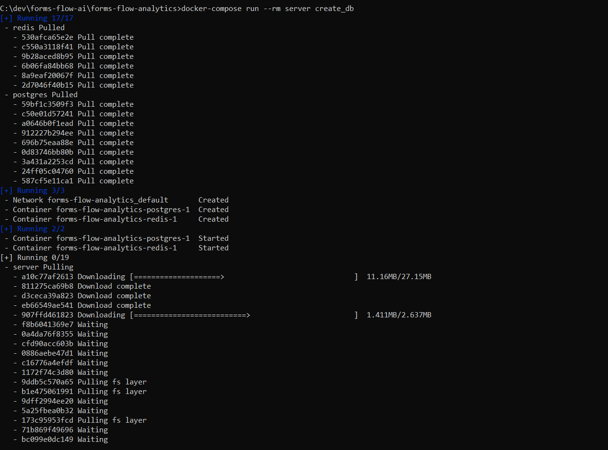
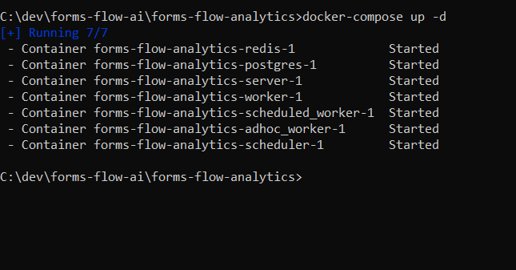
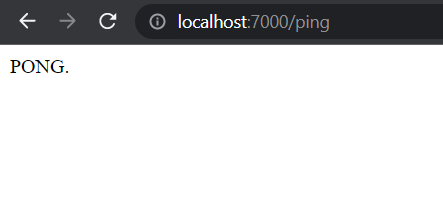
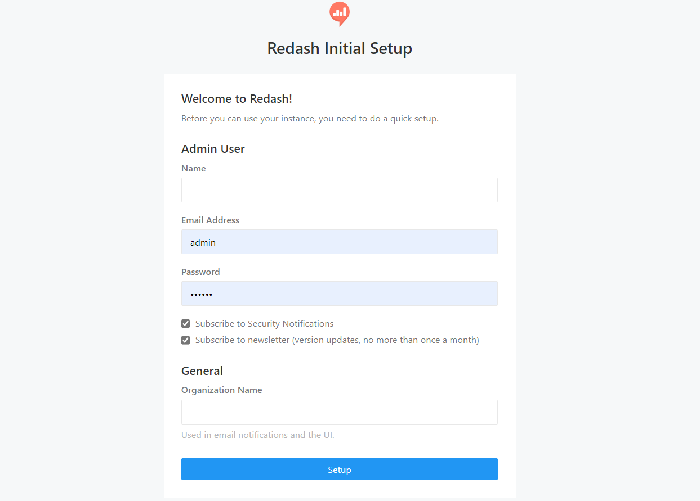

## Analytics Engine  
{: .no_toc }

## Table of contents
{: .no_toc .text-delta }

1. TOC
{:toc}
----

*Formsflow.ai* leverages [Redash](https://github.com/getredash/redash) to build interactive dashboards and gain insights. To create meaningful visualization for your use case with formsflow.ai checkout [Redash Knowledge base](https://redash.io/help/).  

### Prerequisites
- For docker based installation Docker need to be installed.
- Admin access to Keycloak server.  

### Installation 

- Make sure you have a Docker machine up and running.
- Make sure your current working directory is "forms-flow-ai/forms-flow-analytics".
- Rename the file *sample.env* to *.env*.
- Modify the environment variables inside *.env* file if needed. Environment variables are given in the table below.   

> *NOTE : {your-ip-address} given inside the .env file should be changed to your host system IP address. Please take special care to identify the correct IP address if your system has multiple network cards*.  

{: .ml-5}    

* REDASH_HOST  

### Running the application  

- Analytics service uses port 7000, make sure the port is available.
- `cd {Your Directory}/forms-flow-ai/forms-flow-analytics`  

The forked version of redash is being used to overcome the limited cors support in redash. The forked repo fixes the cors issues. But if the environment is setup in such a way that redash resides in the same url origin as forms web application , redash can be built from any redash images. 

- Run `docker-compose run --rm server create_db` to setup database and to create tables.  

{: .ml-5}    

- Run `docker-compose up -d` to start.  

{: .ml-5}  

> NOTE: Use `--build` command with the start command to reflect any future .env changes  
> eg : `docker-compose up --build -d`
 {: .bg-grey-lt-000}  

### To stop the application
- Run `docker-compose stop` to stop.  

## Health Check  

- Check the public endpoint : `{your-ip-address}:7000/ping`  

{: .ml-5}     
- The application should be up and available for use at port defaulted to 7000 in http://localhost:7000/ and register with any valid credentials.  

{: .ml-5}  

## Get the Redash API Key  

--- 
- Login to redash hosted instance (i.e. [http://localhost:7000/](http://localhost:7000/)) using the admin credentials passed for registration / SAML credentials.

{: .ml-5}    

- Go to User Icon -> Profile -> Settings
  - Go to Account Section
  - Copy API Key to Clipboard

  --- 

If you face any issues while installing ,please connect with [us](https://github.com/AOT-Technologies/forms-flow-ai/issues).
{: .text-center }
 
*Copyright© [formsflow.ai](https://formsflow.ai/)*   
{: .text-center}
