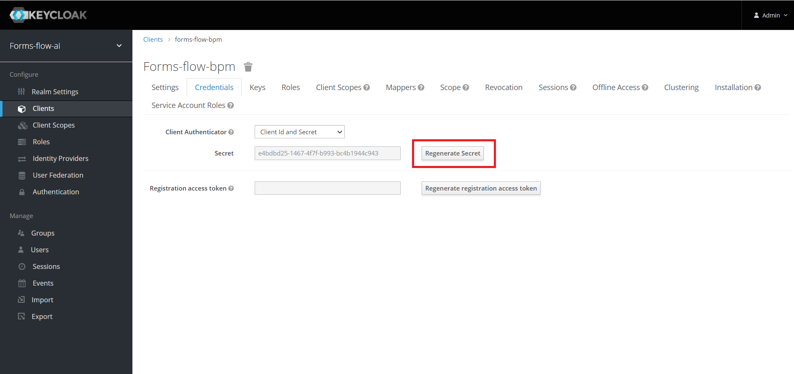

### Get the Keycloak bpm client secret 
 
The KEYCLOAK_BPM_CLIENT_SECRET provided is the default value and each time you install the project you need to regenerate the SECRET key.  

- Go to <a href="http://localhost:8080/" target="_blank"> http://localhost:8080</a> in the browser
- Login to KeyCloak Realm with admin privileges
- Configure > Clients >
- Click on Client ID = forms-flow-bpm
- Got to Credentials Tab
- Regenerate the secret and copy the value  

{: .ml-5}     
