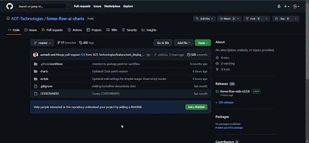

## Quick Installation

---

There are install and uninstall bash scripts included in the forms-flow-ai-charts GitHub repository that allow you to install and uninstall formsflow.ai through a short series of prompts. Once the prerequisites are met, then the forms-flow-ai-charts repository can be cloned into your local machine and the scripts can be run within the 'scripts' directory.

1.Log in to a Kubernetes cluster using the command line interface.  

.gif)
 {: .ml-5}
2.Clone the forms-flow-ai-charts GitHub repository and change directories into the 'scripts' directory. 

 {: .ml-5}

3.Run the install or uninstall script and follow the prompts.

__Install Script__
{: .m-6}

 cd forms-flow-ai-charts/scripts/  
  bash install-forms-flow.sh
  {: .text-grey-lt-000 .bg-grey-dk-250 .p-6 .ml-3}  

 {: .ml-5}

 __Uninstall Script__
{: .m-6}

 cd forms-flow-ai-charts/scripts/
 bash uninstall-forms-flow.sh
 {: .text-grey-lt-000 .bg-grey-dk-250 .p-6 .ml-3}

 
 {: .ml-5}

 >*Note: Persistent Volume Claims must be manually deleted from your Kubernetes project*.

 
 {: .ml-5}

 ---

If you face any issues while installing ,please connect with [us](https://github.com/AOT-Technologies/forms-flow-ai/issues).
{: .text-center }
 
*Copyright© [formsflow.ai](https://formsflow.ai/)*   
{: .text-center}